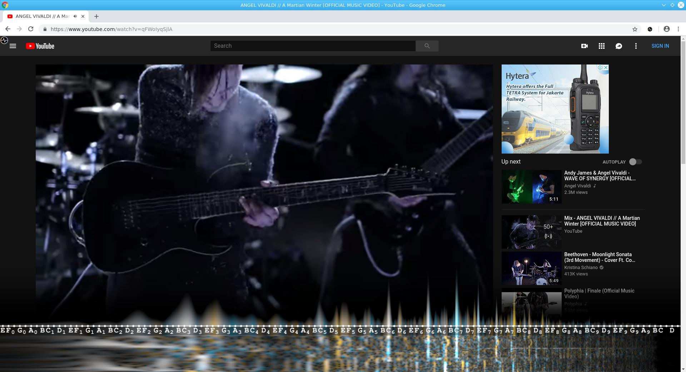
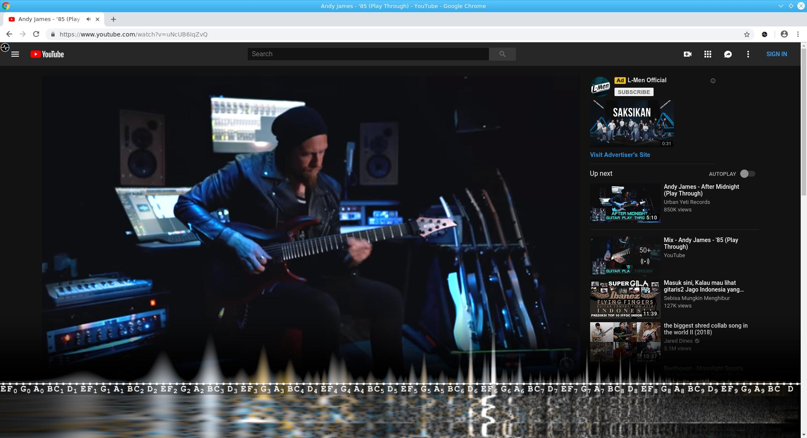

# YouTube Musical Spectrum

[YouTube Musical Spectrum](https://chrome.google.com/webstore/detail/youtube-musical-spectrum/ddpceafiohdlkiemibjgplcicblnfggi) is a Chrome
extension that offers audio visualization on your YouTube page with nice musical notes. It allows you to see waterfall of spectrogram
nicely.

## Install

Install [YouTube Musical Spectrum on Chrome Web Store](https://chrome.google.com/webstore/detail/youtube-musical-spectrum/ddpceafiohdlkiemibjgplcicblnfggi).

## Screenshots

