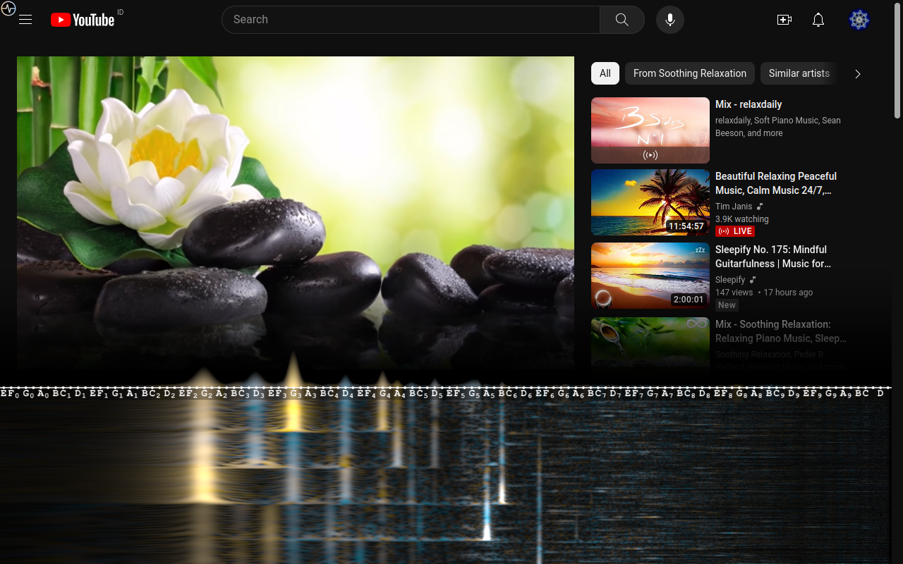
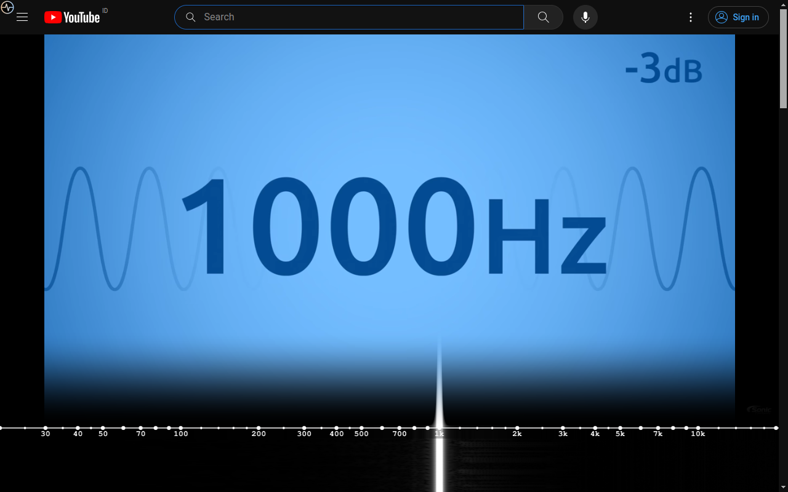
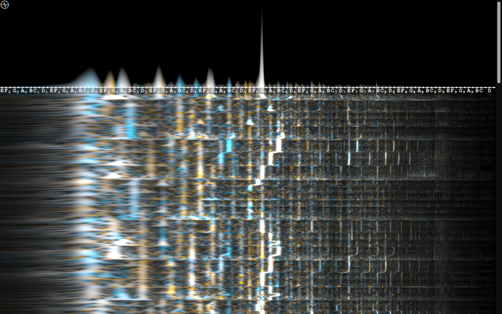
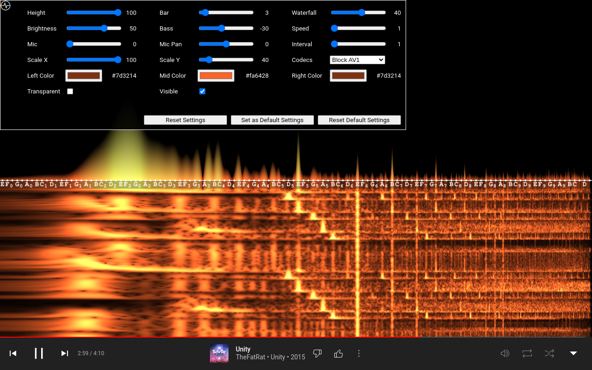
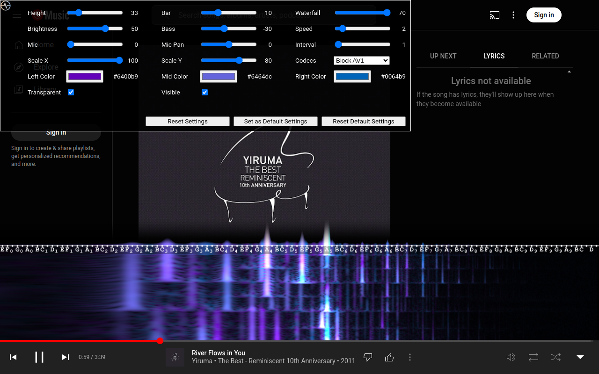

# YouTube Musical Spectrum

YouTube Musical Spectrum is a browser extension powered by [showcqt-js](https://github.com/mfcc64/showcqt-js)
and [showcqt-element](https://github.com/mfcc64/showcqt-element) that offers audio visualization on your
YouTube and YT Music page with nice musical notes. It allows you to see waterfall of spectrogram nicely.
You can see not only spectrogram of YouTube video but also spectrogram of your microphone.

## Install

- Google Chrome: [YouTube Musical Spectrum on Chrome Web Store](https://bit.ly/youtube-musical-spectrum).
- Mozilla Firefox: [YouTube Musical Spectrum on AMO](https://addons.mozilla.org/en-US/firefox/addon/youtube-musical-spectrum/).
- Bookmarklet, on platform that doesn't support browser extension (such as Google Chrome Android),
  you can run YouTube Musical Spectrum using one of these bookmarklets:
    ```
    javascript:import("https://cdn.jsdelivr.net/npm/@mfcc64/ytms/script.mjs")
    ```
    ```
    javascript:import("https://unpkg.com/@mfcc64/ytms/script.mjs")
    ```

## Screenshots











## Settings

Basic usage:
- Click the  icon at the top left corner to open/close settings.
- Press **Ctrl+Alt+H** to open/close settings and show/hide the  icon.
- Press **Ctrl+Alt+G** as a shortcut to show/hide visualization.
- If you want to change the axis, click it.
- If you want to make your change persistent, click **Set as Default Settings** button.

The available settings:
- **Height:** Set the height of the visualizer relative (in percents) to the height of the page. The value is between `20` and `100`.
  The default value is `33`. Setting it to `100` make the visualizer cover the page entirely.
- **Bar:** Set the bar's height. The value is between `1` and `33`. The default value is `17`.
- **Waterfall:** Set the waterfall's height relative (in percents) to the visualizer's height. The value is between `0` and `70`.
  The default value is `33`. Setting it to `0` make the waterfall invisible.
- **Brightness:** Set the brightness of the visualizer. The value is between `1` and `70`. The default value is `17`.
- **Bass:** Set the bass attenuation in dB. The value is between `-50` and `0`. The default value is `-30`.
- **Speed:** Set the speed of the waterfall. The value is between `1` and `12`. The default value is `2`.
  Without frame drops, the speed of the waterfall is `speed * monitor_refresh_rate / interval * 100 / scale_y` pixels/s.
- **Mic:** Allow microphone input. The value of `20` means `4x` gain, `30` means `9x` gain. The default value is `0 (disabled)`.
- **Mic Pan:** Pan microphone input to the left `(-10)` or right `(10)`. The default value is `0`.
- **Interval:** Set the frame rate interval. The value is between `1` and `4`. The default value is `1`.
  Without frame drops, the frame rate of the visualizer is `monitor_refresh_rate / interval`. This is a useful option
  on a high refresh rate monitor (e.g 240 Hz monitor).
- **Scale X:** Set canvas horizontal scale (in percents). Lower value reduces CPU usage but image quality is also reduced.
  The value is between `30` and `100`. The default value is `100`.
- **Scale Y:** Set canvas vertical scale (in percents). Lower value reduces CPU usage but image quality is also reduced.
  This also affects waterfall speed. The value is between `30` and `100`. The default value is `100`.
- **Codecs:** Set allowed codecs to mitigate unsmooth experience. The default value is `Block AV1`. If
  your machine is powerful enough, you probably want to set it to `All`. If your machine has H.264 accelerated
  video playback but no VP9 accelerated playback, you probably want to set it to `Only H.264`.
- **Transparent:** Set the transparency of the visualizer. The default value is set to `true`.
- **Visible:** Set the visibility of the visualizer. The default value is set to `true`.
- **Reset Settings:** Reset settings to the default values (Note that the default values can be changed).
- **Set as Default Settings:** Set the current setttings as the default settings. Subsequent `Reset Settings` or new pages
  will load these settings.
- **Reset Default Settings:** Reset the default settings to the value in this documentation. Subsequent `Reset Settings`
  or new pages will load these settings in this documentation.

  
