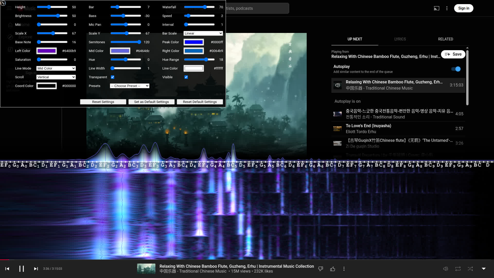

# Youtube Musical Spectrum

[Youtube Musical Spectrum](https://chrome.google.com/webstore/detail/youtube-musical-spectrum/ddpceafiohdlkiemibjgplcicblnfggi) is chrome
extension that offers audio/music visualization on your youtube page with nice musical notes. It allows you to see waterfall of spectrogram
nicely.

## Install

Install [Youtube Musical Spectrum on Chrome Webstore](https://chrome.google.com/webstore/detail/youtube-musical-spectrum/ddpceafiohdlkiemibjgplcicblnfggi).

## Screenshots

