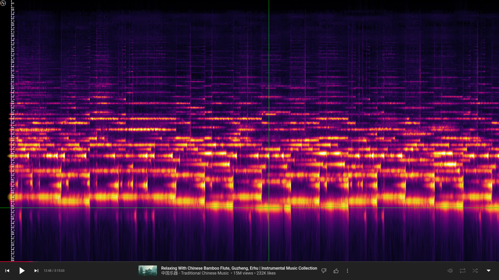

# YouTube Musical Spectrum

YouTube Musical Spectrum is a browser extension powered by [showcqt-js](https://github.com/mfcc64/showcqt-js)
and [showcqt-element](https://github.com/mfcc64/showcqt-element) that offers audio visualization on your
YouTube, YT Music, Spotify, and SoundCloud page with nice musical notes. It allows you to see waterfall of spectrogram nicely.
You can see not only spectrogram of YouTube video but also spectrogram of your microphone.

## Install

- Google Chrome: [YouTube Musical Spectrum on Chrome Web Store](https://mfcc64.github.io/ytms/#chrome).
- Mozilla Firefox: [YouTube Musical Spectrum on AMO](https://mfcc64.github.io/ytms/#firefox).

## Screenshots

## Settings

Basic usage:
- By default, the visualization is visible on YT Music, Spotify, and SoundCloud but hidden on YouTube page.
- Press **Ctrl+Alt+G** as a shortcut to show/hide visualization. This is equivalent to check/uncheck **Visible** setting.
- Click the  icon at the top left corner to open/close settings.
- Press **Ctrl+Alt+H** to open/close settings and show/hide the  icon.
- If you want to change the axis, click it.
- If you want to make your change persistent, click **Set as Default Settings** button.

The available settings:
- **Height:** Set the height of the visualizer relative (in percents) to the height of the page. The value is between `20` and `100`.
  The default value is `33`. Setting it to `100` make the visualizer cover the page entirely.
- **Bar:** Set the bar's height. The value is between `1` and `33`. The default value is `17`.
- **Waterfall:** Set the waterfall's height relative (in percents) to the visualizer's height. The value is between `0` and `100`.
  The default value is `33`. Setting it to `0` make the waterfall invisible.
- **Brightness:** Set the brightness of the visualizer. The value is between `1` and `70`. The default value is `17`.
- **Bass:** Set the bass attenuation in dB. The value is between `-50` and `0`. The default value is `-30`.
- **Speed:** Set the speed of the waterfall. The value is between `1` and `12`. The default value is `2`.
  Without frame drops, the speed of the waterfall is `speed * monitor_refresh_rate / interval * 100 / scale_y` pixels/s.
- **Mic:** Allow microphone input. The value of `20` means `4x` gain, `30` means `9x` gain. The default value is `0 (disabled)`.
- **Mic Pan:** Pan microphone input to the left `(-10)` or right `(10)`. The default value is `0`.
- **Interval:** Set the frame rate interval. The value is between `1` and `4`. The default value is `1`.
  Without frame drops, the frame rate of the visualizer is `monitor_refresh_rate / interval`. This is a useful option
  on a high refresh rate monitor (e.g 240 Hz monitor).
- **Scale X:** Set canvas horizontal scale (in percents). Lower value reduces CPU usage but image quality is also reduced.
  The value is between `30` and `100`. The default value is `100`.
- **Scale Y:** Set canvas vertical scale (in percents). Lower value reduces CPU usage but image quality is also reduced.
  This also affects waterfall speed. The value is between `30` and `100`. The default value is `100`.
- **Bar Scale:** Set bar scale. The default value is `Linear`.
- **Base Note:** Set base note as MIDI number. The default is `16` or `E0`.
- **Semitones:** Set spectrogram range in semitones. The default is `120` or `10 octaves`.
- **Scroll:** Set scroll direction. The default value is `vertical`.
- **Left Color:** Set left color. The default value is `#dcb900`.
- **Mid Color:** Set middle color. The default value is `#dcdcdc`.
- **Right Color:** Set right color. The default value is `#00b9dc`.
- **Saturation:** Enable hue rotation mode and set saturation. When enabled, `Left Color`, `Mid Color`, and `Right Color`
  are ignored, and you can't visualize stereo separation. The default value is `0` (`disabled`).
- **Hue:** Set average hue for hue rotation mode. The unit is `10degree`. The value of `0` is `red`, the value of `12` is `green`, and
  the value of `-12` is `blue`. The default value is `0`.
- **Hue Range:** Set hue range for hue rotation mode. The actual hue will be from `Hue - 0.5 Hue Range` to `Hue + 0.5 Hue Range`.
  The default value is `18`.
- **Line Mode:** Set line mode. The default value is `Off`.
- **Line Width:** Set line width. The default value is `1`.
- **Line Color:** Set line color when `Line Mode` is `Static`. The default value is `#ffffff`.
- **Peak Range:** Set range of peaks for peak detection. The default value is `72`.
- **Peak Color:** Set color of peaks for peak detection. The color is multiplied with spectrogram color. The default is `#ffffff` or `disabled`.
  Both `Peak Range` and `Peak Color` are useful to aid locating peaks especially at low frequency region.
- **Coord Color:** Enable coordinate line and set its color. The default value is `#000000` (`disabled`).
- **Transparent:** Set the transparency of the visualizer. The default value is set to `true`.
- **Visible:** Set the visibility of the visualizer. The default value is set to `false` on YouTube and `true` elsewhere.
- **Presets:** Choose a preset. Currently, most of them are color preset.
- **Reset Settings:** Reset settings to the default values (Note that the default values can be changed).
- **Set as Default Settings:** Set the current setttings as the default settings. Subsequent `Reset Settings` or new pages
  will load these settings.
- **Reset Default Settings:** Reset the default settings to the value in this documentation. Subsequent `Reset Settings`
  or new pages will load these settings in this documentation.

  
