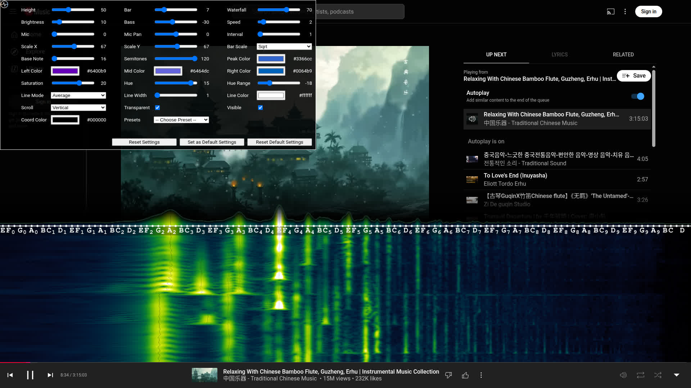

# YouTube Musical Spectrum

YouTube Musical Spectrum is a browser extension powered by [showcqt.js](https://github.com/mfcc64/showcqt-js/blob/master/showcqt.js)
that offers audio visualization on your YouTube page with nice musical notes.
It allows you to see waterfall of spectrogram nicely.

## Install

- Google Chrome: [YouTube Musical Spectrum on Chrome Web Store](https://bit.ly/youtube-musical-spectrum).
- Mozilla Firefox: [YouTube Musical Spectrum on AMO](https://addons.mozilla.org/en-US/firefox/addon/youtube-musical-spectrum/).

## Screenshots

## Settings

If you want to change the settings, click the  icon on the top left corner of your YouTube page
to access the menu (don't forget to reload any YouTube pages that have been opened
before installation), or if it is invisible, press Ctrl+Alt+H. Subsequent click to the  icon
will toggle the menu's visibility. On the other hand, subsequent Ctrl+Alt+H key will toggle the menu's visibility and
the  icon's visibility. You can also toggle the visualizer's visibility by pressing
Ctrl+Alt+G.

The available settings:
- **Height:** Set the height of the visualizer relative (in percents) to the height of the page. The value is between `20` and `100`.
  The default value is `33`. Setting it to `100` make the visualizer cover the page entirely.
- **Bar:** Set the bar's height. The value is between `3` and `33`. The default value is `17`.
- **Waterfall:** Set the waterfall's height relative (in percents) to the visualizer's height. The value is between `0` and `40`.
  The default value is `33`. Setting it to `0` make the waterfall invisible.
- **Brightness:** Set the brightness of the visualizer. The value is between `7` and `49`. The default value is `17`.
- **Bass:** Set the bass attenuation in dB. The value is between `-50` and `0`. The default value is `-30`.
- **Speed:** Set the speed of the waterfall. The value is between `1` and `12`. The default value is `2`.
  Without frame drops, the speed of the waterfall is `speed * monitor_refresh_rate / interval` pixels/s.
- **Interval:** Set the frame rate interval. The value is between `1` and `4`. The default value is `1`.
  Without frame drops, the frame rate of the visualizer is `monitor_refresh_rate / interval`. This is a useful option
  on a high refresh rate monitor (e.g 240 Hz monitor).
- **Codecs:** Set allowed codecs to mitigate unsmooth experience. The default value is `Block AV1`. If
  your machine is powerful enough, you probably want to set it to `All`. If your machine has H.264 accelerated
  video playback but no VP9 accelerated playback, you probably want to set it to `Only H.264`.
- **Transparent:** Set the transparency of the visualizer. The default value is set to `true`.
- **Visible:** Set the visibility of the visualizer. The default value is set to `true`.
- **Reset Settings:** Reset settings to the default values (Note that the default values can be changed).
- **Set as Default Settings:** Set the current setttings as the default settings. Subsequent `Reset Settings` or new pages
  will load these settings.
- **Reset Default Settings:** Reset the default settings to the value in this documentation. Subsequent `Reset Settings`
  or new pages will load these settings in this documentation.

  
